<div align="center">


<br>

[](LICENSE)
[](#-roadmap)
[](#-contributing)
[](#-how-it-works)
[](#-hardware-you-need)
[](#-website--deploy-it-free-forever)

**A real oscilloscope, spectrum analyzer, and protocol decoder — running in your browser, powered by a $4 Raspberry Pi Pico.**
No drivers. No installs. No paywalls.

[Live demo](#-website--deploy-it-free-forever) · [Quick start](#-run-it-locally) · [Features](#-features) · [How it works](#-how-it-works) · [Roadmap](#-roadmap) · [Contributing](#-contributing)

</div>

> [!WARNING]
> **OpenScope is being built in public and is not finished yet.** The hardware-agnostic engine runs today (you can launch the app against a built-in mock device with no hardware). The dashboard UI, measurements, FFT, decoders, and hardware drivers are in active development — see the [roadmap](#-roadmap) for exactly what's live. Star to follow along.

---

## What is OpenScope?

An oscilloscope lets you *see* electrical signals — like a heart monitor for electronics. A decent one costs hundreds of dollars, which puts it out of reach for most students and hobbyists.

**OpenScope turns a $4 microcontroller into one.** Flash a Raspberry Pi Pico, plug it into a signal, open a tab, and watch live waveforms — with triggering, an FFT spectrum view, automatic measurements, CSV export, and protocol decoding. The interface runs entirely in the browser, so there's nothing to install and it works the same on Windows, Mac, Linux, ChromeOS, Android, and even iPhone.

<div align="center">

<br><sub>The interface we're building. This is the design target — the UI is in active development.</sub>
</div>

---

## 🌐 Website & deploy it free, forever

OpenScope is a static web app, so it lives perfectly on **GitHub Pages** — free hosting that never expires. GitHub Pages also serves over HTTPS, which is exactly what the Web Serial API needs to talk to your Pico directly from the browser.

**Live demo (once you deploy):** `https://faysal-shah.github.io/openscope/`

This repo ships a one-click deploy. After your first push:

1. Push to the `main` branch — the included GitHub Action ([`.github/workflows/deploy.yml`](.github/workflows/deploy.yml)) builds the app automatically.
2. Go to **Settings → Pages → Source → "GitHub Actions"**.
3. Your scope is live at your Pages URL, forever, for free.

> If your repository isn't named `openscope`, update the `base` path in [`web/vite.config.ts`](web/vite.config.ts) to match.

---

## ✨ Features

> The list below is the **designed feature set**. See the [roadmap](#-roadmap) for what's working today.

| | Feature | Notes |
| --- | --- | --- |
| 📈 | **Live waveform** | GPU-accelerated trace (WebGL), smooth 60 fps |
| 🎛️ | **Scope controls** | Timebase, volts/div, position, trigger level & edge |
| 🎯 | **Triggering** | Edge trigger on the device itself — rock-steady display |
| 🌈 | **Spectrum / FFT** | See the frequency content live |
| 📐 | **Auto measurements** | VMAX, VMIN, VPP, VRMS, VDC, frequency, period, duty, rise/fall |
| 🔡 | **Protocol decode** | Raw edges to bytes: UART, then I²C and SPI |
| 〰️ | **Any waveform** | Sine, square, triangle, pulses, glitches — whatever's on the wire |
| ⚡ | **Current mode** | I = V/R via a shunt resistor or current probe (see below) |
| 💾 | **CSV export** | Save captures for a spreadsheet or Python |
| 🔭 | **2 channels** | Compare two signals at once |
| 🔌 | **In-browser flashing** | Set up a blank Pico straight from the app |

### About measurements (VMAX, VPP, VRMS… and current)

Voltage measurements are straightforward math on the captured samples, so OpenScope will compute the full set: **VMAX, VMIN, VPP** (peak-to-peak), **VRMS** (your "VAC"), **VDC** (average/mean), amplitude, frequency, period, duty cycle, rise/fall time.

**Current is different — and this is true of *every* oscilloscope, even a $5,000 one.** A scope only measures voltage. To see current you add a **shunt resistor** (OpenScope reads the voltage across it and shows I = V/R) or a **current probe** (clamp). With that in place, OpenScope's *current mode* displays Imax / Imin / Ipp the same way. The extra part is unavoidable physics, not a software limitation.

### About waveforms (sine, square, triangle, spikes)

A scope *displays whatever shape is present* — it doesn't generate them. Sine, square, triangle, and pulses all show up as the shapes they are. The one honest caveat: very fast spikes and sharp edges carry high-frequency content, so on the cheap Pico front-end they may look rounded or get missed. Capturing them faithfully needs more bandwidth — a hardware upgrade, not a software one (see [Specs](#-specs-honest)).

---

## 🛠 How it works

The Pico samples the signal and streams it out; the browser does the display and the math. There are **two ways to connect**, and the second is what lets it run on *any* device.

```mermaid
flowchart LR
    S["Signal<br/>under test"] --> AFE["Analog front-end<br/>attenuate · protect"]
    AFE --> P["Raspberry Pi Pico<br/>ADC · DMA · trigger"]
    P -->|USB| M{Connect}
    M -->|Direct| WS["Web Serial<br/>Chrome / Edge"]
    M -->|Appliance| Z["Raspberry Pi Zero 2 W<br/>serial &#8594; WebSocket + web server"]
    WS --> UI["Browser UI<br/>WebGL scope"]
    Z -->|Wi-Fi| UI

    classDef hw fill:#10241c,stroke:#28d39e,color:#9ff0cf;
    classDef host fill:#10151f,stroke:#3b82f6,color:#bcd4f5;
    classDef ui fill:#1a1530,stroke:#9f7aea,color:#d6c8f5;
    class S,AFE,P hw;
    class Z,WS host;
    class UI ui;
```



**Direct mode** — plug the Pico into a desktop running Chrome or Edge; the app talks to it through the Web Serial API. Zero extra hardware.

**Appliance mode** — plug the Pico into a **Raspberry Pi Zero 2 W**. The Zero serves the app and bridges the Pico's data over Wi-Fi, so you open it from anything (laptop, phone, tablet, even iPhone/Safari) because the browser only needs WebSockets.

### One software, any hardware

Every device — Pico, ESP32-S3, a faster ADC board — is reached through a single contract (the `ScopeDevice` interface in [`web/src/transport/types.ts`](web/src/transport/types.ts)). Supporting new hardware means writing one small adapter; the entire app above it stays identical. Upgrading the hardware later never means rewriting the software.

---

## 📏 Specs (honest)

What the Pico front-end can and can't do:

| Spec | Value |
| --- | --- |
| Channels | 2 analog (shared sample budget) |
| Sample rate | up to **500 kS/s** (≈2 MS/s experimental overclock) |
| Resolution | 12-bit |
| Analog bandwidth | ~150 kHz (front-end dependent) |
| Input range | 0–3.3 V raw — use the front-end for larger/negative signals |
| Logic analyzer | 8 channels (planned) |

> [!IMPORTANT]
> OpenScope is **not** a replacement for a 100 MHz bench scope. It's built for audio, sensors, power-supply ripple, microcontroller-speed signals, and learning. Need more bandwidth later? Because of the one-software/any-hardware design, you swap the front-end (e.g. an external ADC or an FX2 board) and add one adapter — no rewrite.

---

## 🔩 Hardware you need

| Part | Role | Cost |
| --- | --- | --- |
| Raspberry Pi Pico | Samples the signal | ~$4 |
| A few resistors + diodes | Analog front-end (protection + scaling) | ~$1 |
| Raspberry Pi Zero 2 W *(optional)* | Appliance host for any-device access | you may already own one |

You can start in **direct mode with just the Pico** and add the Zero later.

---

## 🚀 Run it locally

> [!NOTE]
> Today this launches the app against a built-in **mock device** — a synthetic signal generator — so you can see it work with **no hardware at all**.

```bash
cd web
npm install
npm run dev
```

A browser opens with a live waveform generated entirely in software. As features land, the same app gains the real UI, measurements, and hardware connections.

---

## 🗺 Roadmap

Built in public, one runnable slice at a time — honest about what's done.

- [x] Architecture, wire protocol & hardware plan
- [x] Hardware-agnostic engine (`ScopeDevice` contract)
- [x] Mock device + running dev harness (no hardware needed)
- [ ] **Phase 1a** — real WebGL trace + dashboard UI
- [ ] **Phase 1b** — timebase, V/div, edge trigger, run/stop/single
- [ ] **Phase 1c** — spectrum (FFT) + measurements (VMAX/VMIN/VPP/VRMS/VDC…)
- [ ] **Phase 1d** — in-browser flashing, board auto-detect, CSV export
- [ ] **Phase 1e** — protocol decode: UART → I²C → SPI
- [ ] **Phase 2** — Web Serial adapter + Pico firmware (first real hardware)
- [ ] **Phase 3** — Pi Zero appliance mode + decoder plugin API

---

## 🧰 Tech stack

- **Engine / app** — TypeScript, Vite
- **Firmware** — C / C++ on the Raspberry Pi Pico SDK (ADC + DMA + PIO)
- **Transport** — Web Serial API (direct) · WebSocket bridge (appliance)
- **Rendering** — [webgl-plot](https://github.com/danchitnis/webgl-plot) for the trace
- **DSP** — JavaScript / WebAssembly (FFT, measurements, decoders)
- **Hosting** — GitHub Pages (free, static, HTTPS)

---

## 🤝 Contributing

**Students and first-time contributors are exactly who this is for.** Firmware, front-end, DSP, or just testing on real hardware — there's a place for you. Protocol decoders are self-contained and make a great first PR. A `CONTRIBUTING.md` is on the way.

---

## ❓ FAQ

<details>
<summary><b>Is it ready to use today?</b></summary>
<br>
Not yet. The engine runs and you can launch it against a mock device, but the real UI, measurements, and hardware drivers are still being built. Follow the roadmap; star to get updates.
</details>

<details>
<summary><b>Can it show VMAX, VPP, VRMS, VDC?</b></summary>
<br>
Yes — the full voltage measurement set is planned and is simple math on the captured samples.
</details>

<details>
<summary><b>Can it measure current?</b></summary>
<br>
Yes, but only with a shunt resistor or a current probe — the same as any oscilloscope. A scope measures voltage; OpenScope then computes and shows current from it.
</details>

<details>
<summary><b>Does it work on iPhone / iPad?</b></summary>
<br>
Yes, via appliance mode with a Pi Zero. Safari doesn't support Web Serial, but it speaks WebSockets, so the Zero does the hardware talking and your iPhone just shows the screen.
</details>

<details>
<summary><b>Can I measure mains / high voltage?</b></summary>
<br>
Not directly — the Pico only accepts 0–3.3&nbsp;V. You <b>must</b> use a proper front-end (attenuation, isolation, protection) for anything else. Never connect mains directly.
</details>

---

## 📜 License

MIT — free for everyone, for any use, forever. See [LICENSE](LICENSE).

## 🙏 Acknowledgements

Built on the shoulders of the open-hardware community — the Raspberry Pi Pico SDK, [webgl-plot](https://github.com/danchitnis/webgl-plot), and the trail blazed by sigrok/PulseView and Scoppy.

<div align="center">
<br>
<b>If you believe everyone deserves a scope, star the repo and help build it.</b>
<br><br>
<sub>OpenScope · built in public · made for students and makers</sub>
</div>
