 

**A real oscilloscope, spectrum analyzer, and protocol decoder — running in your browser, powered by a $4 Raspberry Pi Pico.**
No drivers. No installs. No paywalls.

[Quick start](#-quick-start) · [Features](#-features) · [How it works](#-how-it-works) · [Specs](#-specs-honest) · [Roadmap](#-roadmap) · [Contributing](#-contributing)

---

## What is Oscilla?

An oscilloscope is the single most useful tool on an electronics bench — it lets you *see* electrical signals as they happen. The catch is price: a decent one costs hundreds of dollars, which puts it out of reach for most students, classrooms, and hobbyists.

**Oscilla turns a $4 microcontroller into one.** You flash a Raspberry Pi Pico, plug it into a signal, open a tab, and you're looking at live waveforms — with triggering, an FFT spectrum view, automatic measurements, CSV export, and UART/I²C/SPI protocol decoding. The whole interface runs in the browser, so there's nothing to install and it works the same on Windows, Mac, Linux, ChromeOS, Android — and even iPhone (more on that below).

 ↑ A preview of the interface we're building. The UI is in active development — this is the target.

---

## Why Oscilla?

Cheap scope options exist, but each one trips on something:

| Tool | The catch |
| --- | --- |
| Entry-level bench scopes | $200–400+, big, single workstation |
| Phone-based Pico scopes | Android-only, second channel and ad-removal behind a paywall |
| Classic open-source suites | Powerful, but dated UI and a notoriously rough driver/setup experience |
| Single-vendor PC scopes | Locked to one specific piece of hardware |

Oscilla's bet is that the *software and the experience* are where the real gap is — not the silicon. So it focuses on being **modern, frictionless, completely free, and hardware-flexible**.

#### What makes it different

- 🆓 **Truly free — forever.** Every channel, every feature. No "pro" tier, no ads, no locked second channel. MIT licensed.
- 🌐 **Install nothing.** It's a web app. The first time you ever use it, you're measuring a signal in under a minute.
- 📱 **Runs on any device** — including iPhone and iPad — through *appliance mode* (see [How it works](#-how-it-works)). Most browser-scopes can't do this.
- ⚡ **Flash from the browser.** Click a button to load firmware onto a blank Pico. No SDK, no command line, no UF2 fumbling required.
- 🔌 **Hardware-flexible by design.** A clean hardware-abstraction layer means today's $4 Pico can be swapped for a faster ADC front-end later — same interface, zero UI rewrite.
- 🔬 **A full toolkit, not just a trace.** Scope + spectrum + measurements + protocol decode in one place.

---

## ✨ Features

| | Feature | Description |
| --- | --- | --- |
| 📈 | **Live waveform** | GPU-accelerated trace rendering (WebGL) for smooth 60 fps display |
| 🎯 | **Triggering** | Stable edge trigger handled on the Pico itself — rock-steady waveforms |
| 🌈 | **Spectrum / FFT** | See the frequency content of your signal in real time |
| 📐 | **Auto measurements** | Vpp, Vrms, frequency, period, duty cycle, rise/fall time |
| 🔡 | **Protocol decode** | Turn raw edges into bytes — UART, then I²C and SPI |
| 💾 | **CSV export** | Save captures for analysis in a spreadsheet or Python |
| 🔭 | **2 channels** | Compare two signals at once |
| ⚙️ | **In-browser flashing** | Set up a blank Pico straight from the app |

---

## 🛠 How it works

Oscilla is a small pipeline. The Pico samples the signal and streams it out; the browser does the display and the math. There are **two ways to connect**, and that second one is what lets it run on *any* device.

```mermaid
flowchart LR
    S["Signal<br/>under test"] --> AFE["Analog front-end<br/>attenuate · protect"]
    AFE --> P["Raspberry Pi Pico<br/>ADC · DMA · trigger"]
    P -->|USB| M{Connect}
    M -->|Direct| WS["Web Serial<br/>Chrome / Edge"]
    M -->|Appliance| Z["Raspberry Pi Zero 2 W<br/>serial &#8594; WebSocket + web server"]
    WS --> UI["Browser UI<br/>WebGL scope"]
    Z -->|Wi-Fi| UI

    classDef hw fill:#10241c,stroke:#28d39e,color:#9ff0cf;
    classDef host fill:#10151f,stroke:#3b82f6,color:#bcd4f5;
    classDef ui fill:#1a1530,stroke:#9f7aea,color:#d6c8f5;
    class S,AFE,P hw;
    class Z,WS host;
    class UI ui;
```

**Direct mode** — plug the Pico into a desktop running Chrome or Edge and talk to it through the [Web Serial API](https://developer.mozilla.org/en-US/docs/Web/API/Web_Serial_API). Zero extra hardware. Great for quick bench work.

**Appliance mode** — plug the Pico into a **Raspberry Pi Zero 2 W**. The Zero serves the web app and bridges the Pico's data to your browser over Wi-Fi. Now you open `oscilla.local` from *anything* — your laptop, phone, or tablet, on any browser including Safari/iOS — because the browser only needs WebSockets, not Web Serial. The Zero becomes a tiny plug-in-and-browse scope appliance.

---

## 📏 Specs (honest)

No overselling. Here's exactly what the Pico front-end can and can't do:

| Spec | Value |
| --- | --- |
| Channels | 2 analog (shared sample budget) |
| Sample rate | up to **500 kS/s** (≈2 MS/s with experimental overclock) |
| Resolution | 12-bit |
| Analog bandwidth | ~150 kHz (front-end dependent) |
| Input range | 0–3.3 V raw — use the analog front-end for larger or negative signals |
| Logic analyzer | 8 channels (planned) |

> [!IMPORTANT]
> Oscilla is **not** a replacement for a 100 MHz bench scope. It's built for audio, sensors, power/ripple, microcontroller-speed signals, and learning. Within that range it's genuinely useful — and it costs the price of a coffee.

---

## 🔩 Hardware you need

| Part | Role | Cost |
| --- | --- | --- |
| Raspberry Pi Pico | Samples the signal | ~$4 |
| A few resistors + diodes | Analog front-end (protection + scaling) | ~$1 |
| Raspberry Pi Zero 2 W *(optional)* | Appliance host for any-device access | you may already own one |

You can start in **direct mode with just the Pico** and add the Zero later for appliance mode. Build instructions and the front-end schematic will live in [`docs/hardware`](docs/).

---

## 🚀 Quick start

> [!NOTE]
> Oscilla is in early development — these steps describe the intended flow as features land. Watch/star the repo to follow along.

<b>1 · Flash the Pico</b> (≈30 seconds)

 

1. Open the Oscilla web app.
2. Hold the Pico's **BOOTSEL** button and plug it into USB.
3. Click **Flash firmware** in the app and pick your board.
4. Done — the Pico reboots as an Oscilla front-end.

No SDK, no toolchain, no command line.

<b>2 · Direct mode</b> — desktop Chrome / Edge

 

1. Open the web app in Chrome or Edge.
2. Click **Connect** and select the Pico's serial port.
3. Touch a signal with the probe and watch it appear.

<b>3 · Appliance mode</b> — any device, via Pi Zero 2 W

 

1. Flash the Zero with the Oscilla appliance image.
2. Plug the Pico into the Zero over USB.
3. On any device, open `http://oscilla.local` in any browser.
4. You're scoping — phone, tablet, or laptop, no install anywhere.

---

## 🗺 Roadmap

Built in public, one runnable slice at a time — the scope stays usable at every step.

- [x] Architecture, wire protocol & hardware plan
- [ ] **Phase 0** — firmware ↔ browser data pipe (see real samples flow)
- [ ] **Phase 1a** — live WebGL trace
- [ ] **Phase 1b** — timebase, V/div, edge trigger, run/stop/single
- [ ] **Phase 1c** — spectrum (FFT) + auto measurements
- [ ] **Phase 1d** — in-browser flashing, board auto-detect, CSV export
- [ ] **Phase 1e** — protocol decode: UART → I²C → SPI
- [ ] **Phase 2** — Pi Zero appliance mode + native desktop build
- [ ] **Phase 3** — decoder plugin API so the community adds the long tail

---

## 🧰 Tech stack

- **Firmware** — C / C++ on the Raspberry Pi Pico SDK (ADC + DMA + PIO)
- **Transport** — Web Serial API (direct) · WebSocket bridge (appliance)
- **Rendering** — [webgl-plot](https://github.com/danchitnis/webgl-plot) for the trace · canvas for the spectrum
- **DSP** — JavaScript / WebAssembly (FFT, measurements, decoders)
- **Appliance host** — Raspberry Pi Zero 2 W (lightweight serial→WebSocket + static server)

---

## 🤝 Contributing

**Students and first-time contributors are exactly who this is for.** Whether you write firmware, do front-end, know your DSP, or just want to document and test on real hardware — there's a place for you.

- Browse issues labelled `good first issue`
- Protocol decoders are self-contained and beginner-friendly — a great first PR
- Found a bug or have an idea? Open an issue

A `CONTRIBUTING.md` with setup and architecture notes is on the way.

---

## ❓ FAQ

<b>Is this really an oscilloscope?</b>

 
Yes, for low-frequency work. It samples, triggers, measures, and shows a real-time trace — the core of what a scope does. It just trades raw bandwidth for being open and nearly free. For audio, sensors, and microcontroller signals it's the real deal; for fast digital or RF, you still want a bench scope.

<b>Does it work on iPhone / iPad?</b>

 
Yes — through <b>appliance mode</b> with a Pi Zero. Safari doesn't support Web Serial, but it speaks WebSockets fine, so the Zero does the talking to the hardware and your iPhone just shows the screen.

<b>Do I need the Pi Zero?</b>

 
No. Direct mode needs only the Pico and a Chrome/Edge desktop. The Zero is optional and unlocks any-device access.

<b>Can I measure mains voltage / high voltage?</b>

 
Not directly — the Pico only accepts 0–3.3&nbsp;V. You <b>must</b> use a proper analog front-end (attenuation, isolation, protection) for anything outside that range. Never connect mains directly. Documentation will cover safe front-end designs.

---

## 📜 License

MIT — free for everyone, for any use, forever. See [LICENSE](LICENSE).

## 🙏 Acknowledgements

Standing on the shoulders of the open-hardware community — the Raspberry Pi Pico SDK, [webgl-plot](https://github.com/danchitnis/webgl-plot), and the trail blazed by projects like sigrok/PulseView and Scoppy.

 
<b>If you believe everyone deserves a scope, ⭐ star the repo and help build it.</b>
  
Oscilla · built in public · made for students and makers

